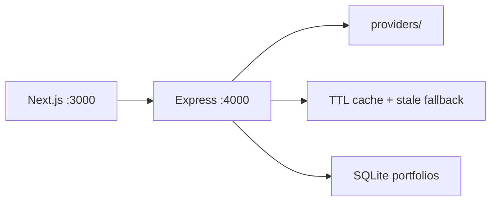

# Architecture

OpenTerminal is two processes: a Next.js app on port 3000 and an Express API on port 4000. `npm run dev` at the repo root starts both.

## Frontend (`web/`)

- Next.js 15, React 19, Tailwind 4, Zustand, TanStack Query.
- Workspace layout and watchlist persist in the browser under the key `openterminal-workspace` (`web/store/terminal.ts`).
- Default active symbol is `AAPL`. Default watchlist is US mega-caps plus SPY.
- Widgets live in `web/components/widgets/`. Linked widgets follow the global active symbol; unlinked ones keep their own.
- Command palette (`web/components/CommandPalette.tsx`) searches symbols and can jump or add to the watchlist.

There is no market switcher yet. Adding SET as an equal market means a UI control plus routing that does not assume US tickers.

## Backend (`server/`)

- Express + TypeScript. Entry: `server/src/index.ts`.
- Routes: `server/src/routes/market.ts` (quotes, charts, search, news, screener, heatmap, options, macro), `portfolio.ts`, `ai.ts`.
- Each data source is a module under `server/src/providers/`. `registry.ts` records latency and tries providers in order via `withFallback`.
- `cache.ts` is an in-memory TTL cache with stale-while-revalidate. A failed upstream can still serve the last good value.

## Database

`server/src/db.ts` opens `data/terminal.db` (WAL). Two tables:

- `portfolios` — id, name
- `transactions` — portfolio_id, symbol, side BUY/SELL, quantity, price, executed_at

Positions are computed in `portfolio.ts` with average cost, not FIFO. Currency, fees, and dividends are not stored. See [Portfolio](./portfolio.md).

## Where SET should plug in

A Thai path should look like any other provider: a new module (or Yahoo/TradingView branches that understand SET), then a change in `getQuotes` so SET symbols are not sent to Nasdaq first. Details: [Providers](./providers.md) and [SET market](./set-market.md).
